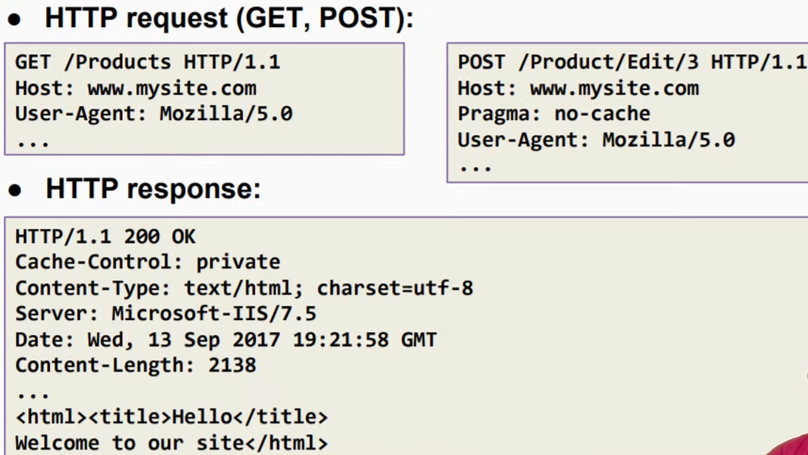

# HTTP, REST, MVC

## HTTP

HTTP - HyperText Transfer Protocol

HTTP is the client-server protocol for transferring web resources. It is the foundation of any data exchange on the web

### Important properties of HTTP

- Request-response model
- Text-based format
- Stateless

### HTTPS: HyperText Transfer Protocol Secure

The SSL (Secure Sockets Layer) protocol is used to encrypt data transmitted between the client and server

### HTTP Request

A request consists of:

- Request line - request method, resource URI, and protocol version
- Request headers - additional parameters, e.g., content type, content length, etc
- Body - optional data, e.g., form data, files, etc.

```code
<request method> <resource URI> HTTP/<version>
<headers>

<request body>
```

```http
GET / HTTP/1.1
Host: example.com
User-Agent: curl/7.64.1
Accept: */*
```

### HTTP Methods (HTTP Verbs)

- GET - Read/retrieve a resource
- POST - Create a resource
- PUT - Update a resource
- DELETE - Delete a resource
- PATCH - Partially update a resource
- OPTIONS - Get the supported HTTP methods
- HEAD - Get the headers of a resource
- CONNECT - Establish a tunnel to the server
- TRACE - Get the request as it is sent to the server
- :: CRUD - Create, Read, Update, Delete

### HTTP Response

A response consists of:

- Status line - protocol version, status code, and status phrase
- Response headers - metadata
- Body - the contents of the response (the requested resource), e.g., HTML, JSON, XML, files, etc.

```code
HTTP/<version> <status code> <status text>
<headers>

<response body>
```

```http
HTTP/1.1 200 OK
```

### HTTP Status Codes

HTTP response status codes indicate whether a specific HTTP request has been successfully completed. Grouped into 5 classes:

- 1xx - Informational: 100 Continue, 101 Switching Protocols
- 2xx - Successful: 200 OK, 201 Created, 204 No Content
- 3xx - Redirection: 301 Moved Permanently, 302 Found, 304 Not Modified, 307 Temporary Redirect
- 4xx - Client Errors: 400 Bad Request, 401 Unauthorized, 403 Forbidden, 404 Not Found, 405 Method Not Allowed
- 5xx - Server Errors: 500 Internal Server Error, 501 Not Implemented, 502 Bad Gateway, 503 Service Unavailable, 504 Gateway Timeout



## MVC

MVC - Model-View-Controller

MVC is a software design pattern that separates the representation of information from the user interface, and the business logic. It is the most commonly used architecture for building web applications.


### MODEL

- classes that describe the data of the application
- classes that represent the business rules for the application
- rules for data manipulation
- may contain data validation rules
- often encapsulate data stored in the db + code used to manipulate the data
- DAL (Data Access Layer) of some kind
- aside from representing the data objects, it doesn't have any significance in the framework

### VIEW

- classes that define the user interface (UI)
- may support master views (layouts) and sub-views (partial views or controls)
- web: template to dynamically generate HTML

### CONTROLLER

- the core MVC component
- classes that handle:
  - request/communication from the user
  - overall app flow
  - app-specific logic
- every controller has one or more 'actions'
  

### API

API - Application Programming Interface

- a set of subroutine definitions, protocols, and tools for building software and apps
- an interface with a set of functions to access specific features or data of an app, OS, or other services
- Web API: API over the web accessible using HTTP.
- API is a concept, not a technology
- Web API: a programmatic interface consisting of one or more publicly exposed endpoints to a defined request-response message system
- typically expressed in JSON or XML

### ENDPOINTS

- specify resource locations
- accessed via a URI with a HTTP request, and returns the response
- endpoints need to be static

## REST

REST - REpresentational State Transfer

- software architectural style for distributed hypermedia systems
- defines a set of guidelines for building web services
- RESTful services provide interoperability between computer systems on the Internet
- RESTful services allow the requesting system to access and manipulate textual representations of web resources by using a uniform and predefined set of stateless operations.

### REST CONSTRAINTS

- client-server architecture
- stateless
- cacheable
- layered system
- code on demand (optional)
- uniform interface
  - resource identification (has a uri)
  - resource manipulation through representations (has verbs)
  - self-descriptive messages (status codes and phrases)
  - hypermedia as the engine of application state (HATEOAS)

### JSON

JSON - JavaScript Object Notation

- open-standard, lightweight data-interchange format
- easy for humans to read and write
- easy for machines to parse and generate
- language independent
- key-value pairs
- arrays/lists/objects
- filename extension: .json
- MIME type: application/json
